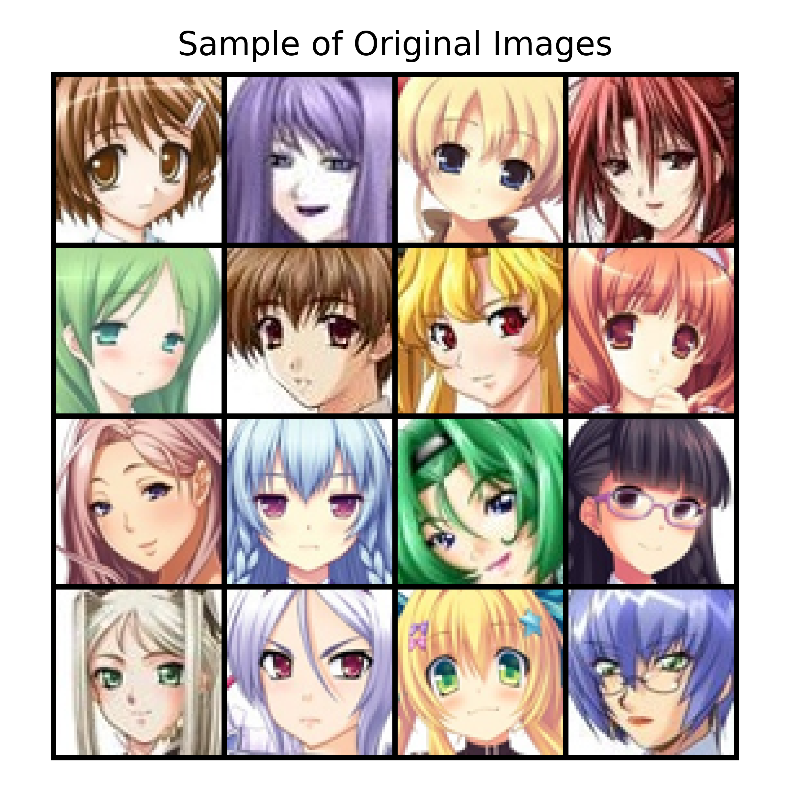
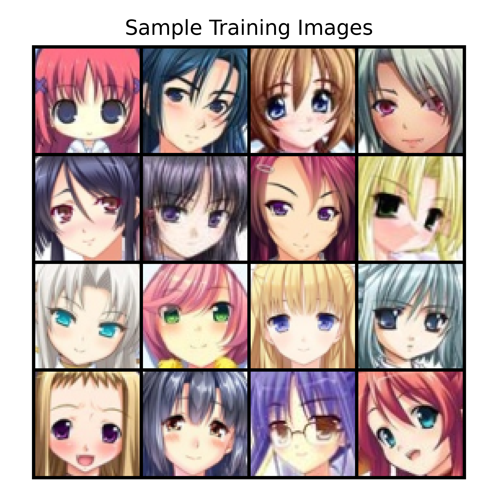
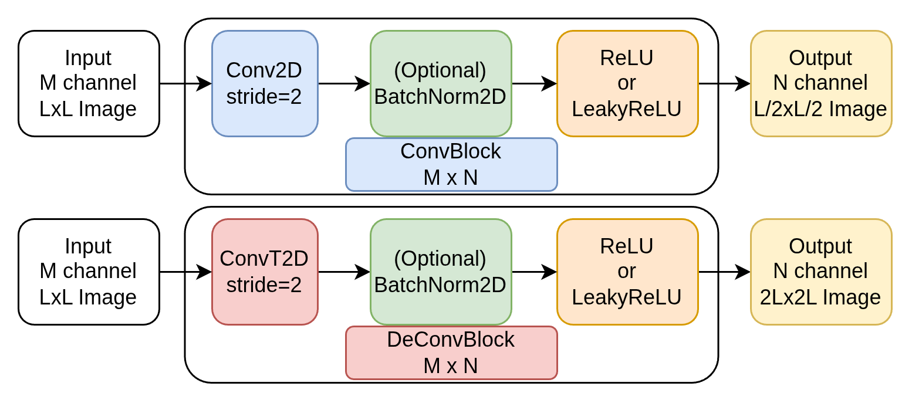
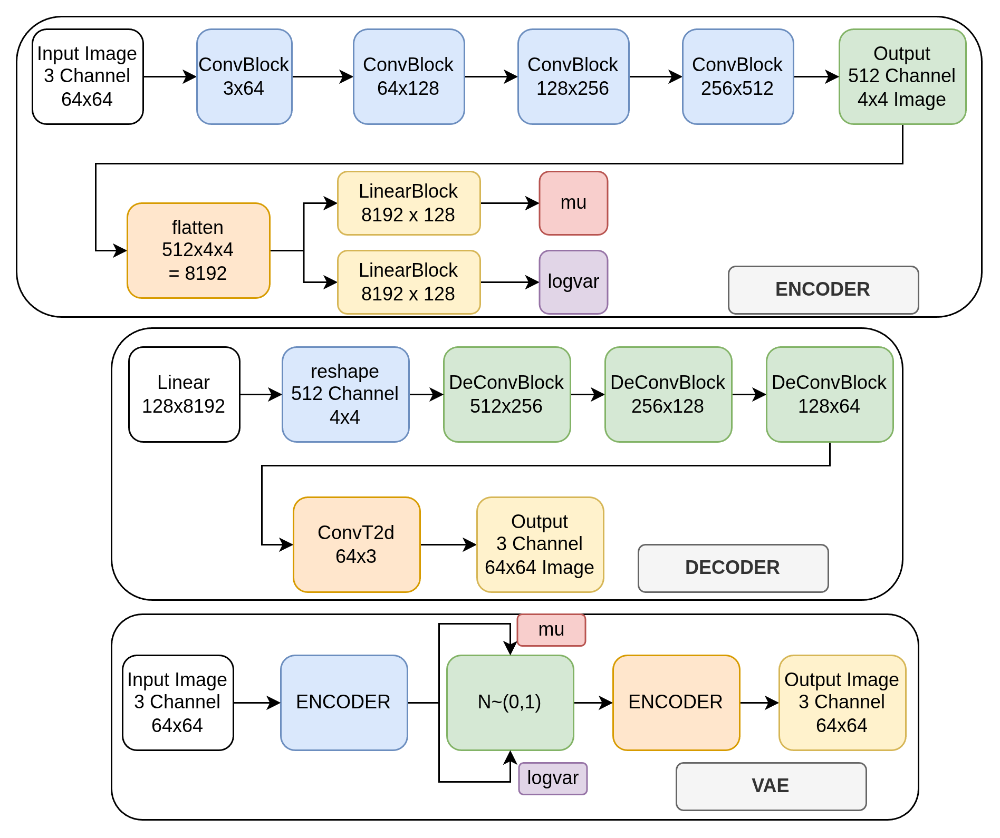

# Generative Model
We are using Anime Face Dataset dataset from Kaggle. The dataset contains `63565` anime-face images, and the goal is to use Variational Auto-Encoder (VAE), to generate anime faces.
__[PDF Report](./report/report.pdf)__

## Dataset
- Name: Anime Face Dataset dataset
- Source: (https://www.kaggle.com/datasets/splcher/animefacedataset)
- Download Info: dataset should be saved in [data folder](./data), with original structure as in the source which contains 1 folders called `images` if downloaded manually, otherwise the provided code for downloading take care of proper settings, and is using `KAGGLE_API_TOKEN` environment variable that can be set as explained in [sample.env](./sample.env). Since dataset is large (`415MB`) it's not added to github.

## How to run the project
- GitHub Link: https://github.com/umscai/zc05-gen-ai
- The project __tested__ with Python version `3.13.14`, and __recommended__ to use python version `3.13 or above`
- The project tested with Torch version: 2.13.0+cu130 (GPU with CUDA Version: 13.2)

1. __Clone__ the repo using the above link (if you have access), or unzip the provided compressed file.
2. __Install__ dependencies using `pip install -r requirements.txt`, or if using uv: `uv add -r requirements.txt`
3. __Run__ `jupyter lab`, and open and run the notebook located at `notebook/generative_model.ipynb`

## Folder and File Structure
Project folder and file structures are shown below, where `generative_model.ipynb` is main notebook, and all supporting functions collected `src` folder: `utils.py` (general helper-function) and `vae` folder (ML related helper-function/class), and final report is under report folder, data folder devoted to downloaded dataset, and out folder used to save output files like best model parameters.

data folder and out folder are not part of git repo, data-folder will be populated when dataset is downloaded, and out folder generated during run.
```console
.
TODO
```

## Data Cleaning
No cleaning was required for this dataset
## EDA
Images have different heigh/width, with aspect ratio of 1 (with little deviation). All images are RGB images, and will be converted to to size 64x254 for machine learning processing.

sample image from original files shown below




## ML
### Dataset preparation-
- Split dataset to train (`80%`), validation (`10%`) and test (`10%`).
- prepare inference transformation for validation, and testing
- prepare training transformation with additional transformation (only random horizontal flip added)

sample of transformed images for training



### VAE model
The VAE build from Encoder (contains ConvBlock) and Decoder Block (contains DeconvBlock), as shown below:
#### ConvBlock and DeConvBlock


#### Encoder/Decoder and VAE



## Results

### Final Accuracy comparison


### Training curve/progress comparison


